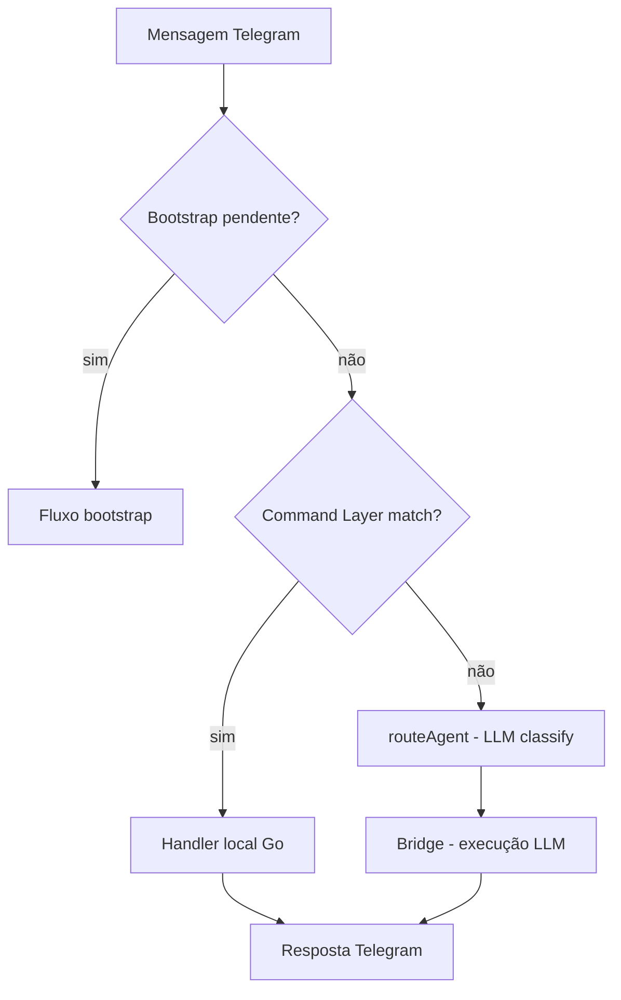

# Command Layer — Design

**Spec**: `.specs/features/command-layer/spec.md`
**Status**: Approved

---

## Architecture Overview

Uma camada de interceptação no `processInput()` que detecta comandos do sistema por keywords antes de qualquer routing de agent ou chamada ao LLM. Comandos matched são resolvidos localmente em Go e respondem direto no Telegram.



O command layer fica **depois** do bootstrap check (bootstrap tem prioridade) e **antes** do `routeAgent()`.

---

## Code Reuse Analysis

### Existing Components to Leverage

| Component | Location | How to Use |
|-----------|----------|------------|
| Cron Service | `internal/cron/service.go` | CRUD direto: `AddRecurringJob`, `AddOnceJob`, `ListJobs`, `PauseJob`, `DeleteJob` |
| Cron Store | `internal/cron/store.go` | `ListJobsByChat`, `ResolveJobID` pra busca por prefixo |
| Session Store | `internal/session/store.go` | `Clear(chatID)` pra reset de sessão |
| Session Tracker | `internal/session/tracker.go` | `Clear(chatID)` pra limpar usage junto |
| Agent Registry | `internal/agents/registry.go` | `Agents()` pra listar agents disponíveis |
| Config | `internal/config/config.go` | `DefaultModel`, `Providers` pra status e lista de modelos |
| Message Sending | `internal/telegram/send.go` | `SendTextReply`, `SendError` pra responder no Telegram |
| Bridge | `internal/bridge/bridge.go` | `ExecuteSync` pra extração de parâmetros (cron create) |

### Integration Points

| System | Integration Method |
|--------|-------------------|
| `processInput()` | Inserir check de comando antes de `routeAgent()` |
| `BotController` | Command handlers recebem acesso ao controller via receiver |

---

## Components

### CommandMatcher

- **Purpose**: Detecta se uma mensagem é um comando do sistema por keyword matching
- **Location**: `internal/telegram/commands.go`
- **Interface**:
  - `Match(text string) *MatchedCommand` — retorna comando matched ou nil
- **Dependencies**: Nenhuma (pure function)
- **Reuses**: Nada — lógica nova e simples

O matcher usa uma lista de regras por comando. Cada regra tem keywords e frases que indicam intenção. O match é case-insensitive e verifica se a mensagem **começa com** ou **contém** as keywords em contexto de comando (não no meio de uma frase narrativa).

**Estratégia anti-falso-positivo**: Verificar posição da keyword. "agenda uma reunião" matcha. "ontem eu tentei agendar uma reunião" não matcha porque a keyword está depois de palavras narrativas (ontem, eu, tentei).

Regras por comando:

| Comando | Keywords/frases |
|---------|-----------------|
| cron_create | "agenda", "agendar", "lembrete", "cria um agendamento", "me lembra" |
| cron_list | "meus agendamentos", "o que tá agendado", "lista agendamentos" |
| cron_cancel | "cancela agendamento", "remove lembrete", "desativa agendamento" |
| session_reset | "nova conversa", "limpa o contexto", "reset", "começa de novo" |
| status | "status", "tá funcionando" |
| list_agents | "quais agents", "lista agents", "meus agents" |
| list_models | "quais modelos", "lista modelos", "lista provedores" |

### CommandHandler

- **Purpose**: Executa o comando matched e retorna a resposta pro Telegram
- **Location**: `internal/telegram/commands.go`
- **Interface**:
  - `HandleCommand(c telebot.Context, cmd *MatchedCommand) error`
- **Dependencies**: `BotController` (acesso a cron service, sessions, agents, config, bridge)
- **Reuses**: Todos os services existentes

Cada tipo de comando tem um handler function:

#### cron_create

1. Detecta intenção de agendar (matcher)
2. Extrai parâmetros com **LLM focado** via `bridge.ExecuteSync`:
   - System prompt específico: "Extraia schedule e prompt da mensagem. Responda em JSON: {type, cron_expr, run_at, prompt}"
   - `MaxTurns: 1`, modelo mais barato disponível
   - Timeout: 5s (vs 15s do classify atual)
3. Parse do JSON retornado
4. Chama `cronService.AddRecurringJob()` ou `AddOnceJob()`
5. Confirma no Telegram: "Agendado: X todo dia às 9h"

**Por que LLM aqui?** Parsing de linguagem natural pra cron expression ("toda segunda às 9h" → `0 9 * * 1`) é complexo demais pra regex. Mas é um call focado e rápido — não uma conversa completa.

#### cron_list

1. Chama `cronService.ListJobs(ctx, chatID)`
2. Formata tabela com ID (prefixo), prompt, schedule, status
3. Responde no Telegram

**100% local, zero LLM.**

#### cron_cancel

1. Extrai identificador do job (ID prefixo ou nome)
2. Chama `cronStore.ResolveJobID(ctx, prefix)` pra resolver ID completo
3. Chama `cronService.PauseJob(ctx, jobID)` ou `DeleteJob(ctx, jobID)`
4. Confirma no Telegram

**100% local** se o usuário passa o ID. Se passa descrição ("cancela o lembrete da reunião"), pode precisar de um match fuzzy na lista de jobs.

#### session_reset

1. Chama `sessions.Clear(chatID)`
2. Chama `tracker.Clear(chatID)`
3. Responde: "Contexto limpo. Próxima mensagem começa uma conversa nova."

**100% local, zero LLM.**

#### status

1. Consulta estado do bridge (alive/recovery)
2. Conta agents do registry: `len(agents.Agents())`
3. Conta cron jobs ativos: `cronService.ListJobs(ctx, chatID)`
4. Lê modelo padrão: `config.DefaultModel`
5. Formata e responde

**100% local, zero LLM.**

#### list_agents

1. Itera `agents.Agents()`
2. Formata: nome + descrição de cada agent
3. Responde no Telegram

**100% local, zero LLM.**

#### list_models

1. Itera `config.Providers`
2. Pra cada provider: nome, modelo padrão, se tem API key configurada
3. Formata tabela e responde

**100% local, zero LLM.** Precisa de um mapeamento de provider → modelos disponíveis (novo, pequeno).

---

## Data Models

Nenhum modelo novo. Todos os dados já existem:

- `CronJob` — `internal/cron/types.go`
- `session.Store` — `internal/session/store.go`
- `agents.Agent` — `internal/agents/types.go`
- `config.AppConfig` — `internal/config/config.go`

### Novo: Provider Model Map (constante)

```go
// internal/config/models.go
var ProviderModels = map[string][]string{
    "anthropic":  {"claude-sonnet-4-6", "claude-opus-4-6", "claude-haiku-4-5"},
    "google":     {"gemini-2.5-pro", "gemini-2.5-flash"},
    "kimi":       {"kimi-k2-thinking", "kimi-k2"},
    "openrouter": {"openrouter/auto"},
}
```

---

## Error Handling Strategy

| Error Scenario | Handling | User Impact |
|---|---|---|
| Cron create: LLM extração falha | Responde "Não entendi o agendamento, tenta de novo com mais detalhes" | Pode tentar novamente |
| Cron create: JSON parse falha | Mesmo acima — pede clarificação | Pode tentar novamente |
| Cron create: cron expr inválida | Responde com erro específico do que deu errado | Sabe o que corrigir |
| Cron cancel: job não encontrado | "Não encontrei esse agendamento. Use 'meus agendamentos' pra ver a lista" | Guia pro próximo passo |
| Session reset: sessão já vazia | Responde normalmente "Contexto limpo" (idempotente) | Sem confusão |
| Command matcher falso positivo | Usuário recebe resposta de comando em vez de conversa | Pode reformular — LLM não é chamado então é rápido corrigir |

---

## Tech Decisions

| Decision | Choice | Rationale |
|---|---|---|
| Keyword matching vs NLP | Keywords simples | Anti-overengineering. Se falso positivos virarem problema, evolui depois |
| LLM pra parsing de cron | Sim, call focado de 5s | "toda segunda às 9h" → `0 9 * * 1` é complexo demais pra regex, mas um call focado é muito mais barato que o flow completo |
| Arquivo único vs pacote | Arquivo único `commands.go` | Escopo pequeno, não justifica pacote separado. Se crescer, extrai |
| Handler no BotController | Sim, como métodos | Precisa acesso a todos os services (cron, session, agents, config, bridge) |
| Anti-falso-positivo | Heurística de posição da keyword | Se keyword aparece depois de palavras narrativas, não intercepta |
