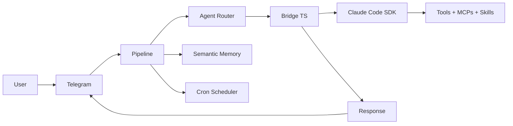

<div align="center">

# Aurelia OS


**An autonomous agent operating system in Go.**

Telegram-native. Claude Code-powered. Semantic memory. Built to stay light.

One persistent daemon, many projects, many agents.

[](https://go.dev/)
[](#runtime-model)
[](docs/ARCHITECTURE.md)
[](#semantic-memory)
[](https://sqlite.org/)
[](https://core.telegram.org/bots/api)
[](https://platform.claude.com/docs/en/agent-sdk)

</div>

## Why Aurelia OS

Aurelia is an autonomous agent operating system accessible via Telegram. Talk naturally — Aurelia decides whether to respond directly, delegate to a specialist agent, or schedule automated execution.

It is built around a practical execution model:

- Go daemon (24/7, lightweight)
- TypeScript Bridge wrapping the Claude Agent SDK
- Claude Code CLI as the brain (tools, MCPs, skills, subagents)
- SQLite semantic memory with local ONNX embeddings
- Configurable agents in markdown
- Persistent cron scheduler with Telegram delivery
- Multi-provider: Anthropic, Kimi, OpenRouter, Z.ai, Alibaba

The goal is not to reimplement what Claude Code already does.
The goal is to orchestrate it — adding persistence, scheduling, multi-project support, and a natural Telegram interface on top.

## Core Capabilities

- **Natural conversation** via Telegram with text, photos, voice, and documents
- **Autonomous coding** — reads, writes, edits files, runs commands, searches code
- **Multi-project** — work on different projects simultaneously with isolated contexts
- **Async execution** — messages process in parallel, responses arrive when ready
- **Session continuity** — conversation context persists across messages via session resume
- **Semantic memory** — local ONNX embeddings (all-MiniLM-L6-v2) for context retrieval
- **Smart routing** — LLM-based classification routes messages to the right agent
- **Persistent scheduling** — create cron jobs via natural conversation, results delivered to Telegram
- **Tool progress** — see what Claude Code is doing in real-time (reading files, running commands...)
- **Reply-to** — responses quote the original message for async conversation clarity
- **Reactions** — contextual emoji reactions via CLI
- **Photo analysis** — images downloaded and passed to Claude Code for visual analysis
- **Voice transcription** — Groq STT converts voice messages to text
- **Inherits your setup** — MCPs, skills, plugins, and hooks from your Claude Code account

## Runtime Model

Aurelia separates three scopes:

1. **Repository** — product source code
2. **Local instance** — user runtime state (`~/.aurelia/`)
3. **Target projects** — external codebases the agent works on

High-level flow:



### Message Flow

```
1. Message arrives on Telegram
2. Pipeline extracts text/photo/voice/document
3. Agent router classifies → specialist agent or general
4. System prompt assembled: persona + agent + cron instructions + memory context
5. Request sent to Bridge (long-lived TypeScript process)
6. Bridge calls Claude Code SDK → Claude Code CLI executes
7. Events streamed back: tool_use → progress, assistant → text, result → response
8. Response delivered to Telegram (reply-to original message)
9. Conversation saved to semantic memory
```

### Cron Flow

```
1. Scheduler polls every 15 seconds
2. Due job found → load agent config + persona + memory
3. Execute via Bridge (Telegram plugin blocked to prevent wrong bot)
4. Result delivered to Telegram via Aurelia's own delivery function
5. Saved to memory
```

## Architecture

```text
cmd/aurelia/              CLI entry point, onboarding, cron CLI, telegram CLI
internal/bridge/          Go ↔ Bridge client (long-lived, multiplexed, bundle embedded via go:embed)
internal/telegram/        Telegram I/O, async pipeline, sessions, progress, reactions
internal/memory/          Semantic memory (SQLite + local ONNX embeddings)
internal/agents/          Agent registry (markdown definitions)
internal/persona/         Persona loader (IDENTITY / SOUL / USER)
internal/cron/            Persistent cron scheduler with Telegram delivery
internal/config/          App configuration (providers, Telegram, embedding)
internal/runtime/         Path resolver + instance bootstrap
pkg/stt/                  Speech-to-text (Groq Whisper)
bridge/                   TypeScript Bridge source (compiled to bundle.js via esbuild, embedded in binary)
```

### Bridge Protocol

The Bridge is a **long-lived** TypeScript process that wraps `@anthropic-ai/claude-agent-sdk`. Communication is via stdin/stdout NDJSON with request multiplexing:

**Go → Bridge (stdin):**
```json
{"command":"query","request_id":"req-1","prompt":"...","options":{"model":"k2.5","system_prompt":"...","cwd":"/path","permission_mode":"bypassPermissions"}}
```

**Bridge → Go (stdout):**
```json
{"event":"system","request_id":"req-1","session_id":"abc-123","tools":["Read","Write"]}
{"event":"tool_use","request_id":"req-1","name":"Read","input":{"file_path":"src/main.go"}}
{"event":"assistant","request_id":"req-1","text":"The project has..."}
{"event":"result","request_id":"req-1","content":"...","cost_usd":0.12,"session_id":"abc-123"}
```

Multiple requests run concurrently — each with its own `request_id`.

### Semantic Memory

SQLite with local ONNX embeddings (all-MiniLM-L6-v2, 384 dimensions). No external API needed.

- **Save** — generates embedding, stores content + vector as BLOB
- **Search** — cosine similarity against all stored embeddings, returns top N
- **Inject** — formats relevant memories as markdown block for system prompt

Falls back to word-hash embeddings if the ONNX model is not available.

### Agents

Configurable specialists defined in markdown (`~/.aurelia/agents/`):

```markdown
---
name: prospector
description: Busca leads e entra em contato
model: kimi-k2-thinking
schedule: "0 9 * * 1"
cwd: D:\projetos\crm
mcp_servers:
  google-places: { command: "npx google-places-mcp" }
allowed_tools: ["WebSearch", "WebFetch", "Bash"]
---

Voce eh um agente de prospeccao comercial.
Busque empresas no Google Places na regiao configurada.
```

Fields: `name`, `description`, `model`, `schedule`, `cwd`, `mcp_servers`, `allowed_tools`.

Agents with `schedule` are automatically registered in the cron scheduler.

### Persona

Three markdown files in `~/.aurelia/memory/personas/`:

- `IDENTITY.md` — name, role, rules, personality
- `SOUL.md` — tone, style, behavior
- `USER.md` — user information, preferences

Created automatically via `/start` on Telegram (choose "Coder" or "Assistant" preset).

## Telegram Commands

| Command | Description |
|---------|-------------|
| `/start` | Setup persona (first run) or welcome |
| `/help` | List available commands |
| `/cwd <path>` | Set working directory for this chat |
| `/reset` | Reset session (new conversation) |
| `/cron` | Manage schedules (list, add, delete, pause, resume) |
| `/agents` | List available agents |

## CLI

```bash
# Run the bot
go run ./cmd/aurelia/

# Interactive onboarding
go run ./cmd/aurelia/ onboard

# Cron management
aurelia cron add "30 8 * * *" "pesquise noticias de tech" --chat-id 123456
aurelia cron once "2026-03-22T09:00:00Z" "gere relatorio" --chat-id 123456
aurelia cron list
aurelia cron del <job-id>

# Telegram interaction (used by the agent via Bash)
aurelia telegram react <chat-id> <message-id> <emoji>
aurelia telegram send <chat-id> <text>
aurelia telegram reply <chat-id> <message-id> <text>
```

## Setup

Requirements:

- Go `1.25+`
- Node.js `18+`
- Telegram bot token
- One LLM provider:
  - **Anthropic** — API key or Max subscription (uses OAuth via `claude login`)
  - **Kimi** — API key (Anthropic-compatible endpoint)
  - **OpenRouter** — API key (multi-model proxy)
  - **Z.ai** — API key (GLM Coding Plan)
  - **Alibaba** — API key (Qwen Coding Plan)
- Groq API key for voice transcription (optional)

### Quick Start

1. Run onboarding:
   ```bash
   go run ./cmd/aurelia/ onboard
   ```

2. Start:
   ```bash
   go run ./cmd/aurelia/
   ```

3. Send `/start` to your bot on Telegram.

### Hot Reload (Development)

```bash
go install github.com/air-verse/air@latest
air
```

### Local Embeddings (Optional)

For semantic memory with real embeddings instead of word-hash fallback:

```bash
mkdir -p ~/.aurelia/models/all-MiniLM-L6-v2
cd ~/.aurelia/models/all-MiniLM-L6-v2
curl -L -o model.onnx "https://huggingface.co/sentence-transformers/all-MiniLM-L6-v2/resolve/main/onnx/model.onnx"
curl -L -o tokenizer.json "https://huggingface.co/sentence-transformers/all-MiniLM-L6-v2/resolve/main/tokenizer.json"
curl -L -o config.json "https://huggingface.co/sentence-transformers/all-MiniLM-L6-v2/resolve/main/config.json"
curl -L -o tokenizer_config.json "https://huggingface.co/sentence-transformers/all-MiniLM-L6-v2/resolve/main/tokenizer_config.json"
curl -L -o special_tokens_map.json "https://huggingface.co/sentence-transformers/all-MiniLM-L6-v2/resolve/main/special_tokens_map.json"
```

### Config

Main config lives in `~/.aurelia/config/app.json`:

```json
{
  "default_provider": "anthropic",
  "default_model": "claude-sonnet-4-6",
  "providers": {
    "anthropic": { "auth_mode": "subscription" },
    "kimi": { "api_key": "sk-kimi-..." }
  },
  "telegram_bot_token": "your-token",
  "telegram_allowed_user_ids": [123456789],
  "stt_provider": "groq",
  "max_iterations": 500,
  "memory_window_size": 20
}
```

Provider base URLs are auto-configured. For Anthropic subscription mode, run `claude login` first.

### Release Build

```bash
go build -trimpath -ldflags "-s -w" -o ./build/aurelia.exe ./cmd/aurelia
```

## Documentation

| Document | Purpose |
|----------|---------|
| [AGENTS.md](AGENTS.md) | Workflow rules, bridge protocol, agent format |
| [docs/ARCHITECTURE.md](docs/ARCHITECTURE.md) | Architecture, layers, decisions |
| [docs/STYLE_GUIDE.md](docs/STYLE_GUIDE.md) | Code conventions, Go patterns |
| [docs/LEARNINGS.md](docs/LEARNINGS.md) | Operational lessons |

## Development

```bash
go build ./...        # Build
go test ./... -short  # Test
go vet ./...          # Lint
air                   # Hot reload
```

To rebuild the Bridge bundle after modifying `bridge/index.ts`:

```bash
cd bridge && npx esbuild index.ts --bundle --platform=node --target=node18 --outfile=bundle.js --format=esm
cp bundle.js ../internal/bridge/bundle.js
```

## Current State

- Go test suite is green (11 packages)
- TypeScript Bridge compiles clean
- Production code: ~6,800 lines Go + ~270 lines TypeScript
- Active development on `feat/aurelia-os` branch
